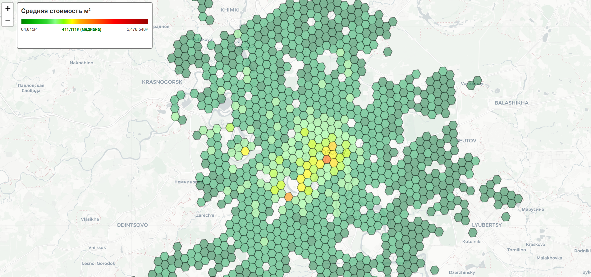

# 🌇 CIAN PARSER 

Проект для сбора и анализа данных об объявлениях о продаже недвижимости с CIAN.ru. В настоящий момент производит сбор данных по Москве и Московской области, но может быть масштабирован и использован для других регионов.
В связи с активной защитой целевого сайта возможны проблемы с доступом к нему. Была проведена работа по преодолению этих проблем, но остается вероятность блокировки при использовании.

## 📑 Основные функции 
1. **Сбор данных:** Сбор id объявлений со страниц поиска. Парсинг предложений по их id, сохранение цены и данных, влияющих на стоимость квартиры
3. **Экспорт:** Сохранение данных по каждой квартире в формате CSV/JSON для дальнейшего использования
4. **Визуализация:** построение тепловой карты (разделение территории на гексагоны, определение средней стоимости квадратного метра в пределах гексагона)
5. **Анализ полученных данных:** (в разработке)

Пример тепловой карты


## 🛡️ Работа с антибот-системами 
- **Проблема:** При агрессивном парсинге сайт предпринимает попытку защиты от нежелательной активности посредством блокирования IP-адреса.
На практике привело к временной блокировке доступа к сайту. 

- **Решение:** Спроектировано архитектурное решение, уменьшающее вероятность возникновения такого рода ошибок.
Реализованы рандомизированные задержки при переходе между запросами и экспоненциальные задержки при попытке замены прокси с целью имитации человеческого поведения (непосредственно замена прокси находится на этапе разработки).

## 🔨 Стек технологий
`Python` `Requests` `BeautifulSoup4` `Pandas` `H3` `Folium`

## 🚀 Как запустить проект
1.  Клонируйте репозиторий:
    ```bash
    git clone https://github.com/Annnnzzzz/algorithms
    ```
2.  Установите зависимости:
    ```bash
    pip install -r requirements.txt
    ```
3.  Запустите основной скрипт:
    ```bash
    python main.py
    ```

## 📃 Лицензия
MIT License
